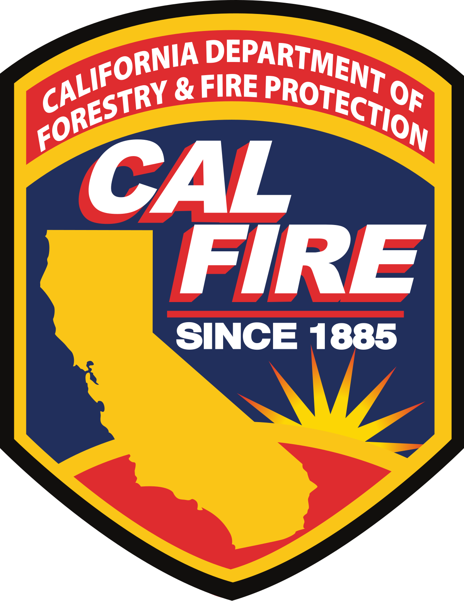

## California Fire Data (2016-2020)

 

  
## Overview
In an effort to provide a more detailed view of the forest fires in the state of California, we have created an interactive map supplemented by graphs detailing the the extent of the fires in the state from 2016 to present day. The interactive map displays icons indicating the location of the fire. When the icons are clicked on, information showing the county where the fire is located, start and extinguish date, total acres burned, and a direct link to the Cal Fire website page detailing that specific fire. Additionally, users can chose which years fires they would like to look at by clicking the icon located at the top right of the map. 

## Data Sets Used

Fire data collected from the [Cal Fire API](https://www.fire.ca.gov/umbraco/api/IncidentApi/GeoJsonList?inactive=false)
