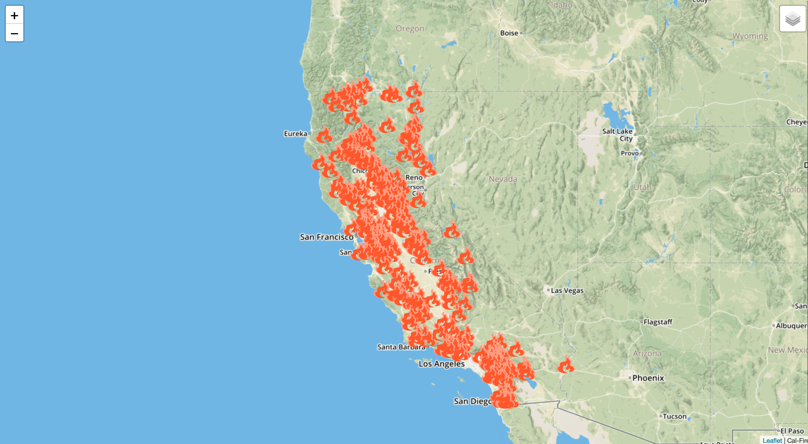

## California Fire Data (2016-2020)

 

  
## Overview
In an effort to provide a more detailed view of the forest fires in the state of California, we have created an interactive map supplemented by graphs detailing the the extent of the fires in the state from 2016 to present day. The interactive map displays icons indicating the location of the fire. When the icons are clicked on, a dropdown box will appear which will contain information showing the county where the fire is located, start and extinguish date, total acres burned, and a direct link to the Cal Fire website page detailing that specific fire. Additionally, users can chose which year's fires they would like to look at by clicking the icon located at the top right of the map. 

 

 
                                  
## Data Sets Used

Fire data collected from the [Cal Fire API](https://www.fire.ca.gov/umbraco/api/IncidentApi/GeoJsonList?inactive=false)

## Tools Used

* Javascript     
* MapBox
* Leaflet
* Flask
* Python
* Pandas
* Plotly

## Flask Deployment Instructions
* Step 1: Download the Repository
* Step 2: Use the terminal to navigate to the root directory
* Step 3: In terminal, type Python -m flask run
* Step 4: Put the server address into your browser

## Visualizations

## Observations from the Data
There were a large number of fires each year
Especially when the years are combined, the map gets cluttered
The icons do not differentiate by size of fire, large fires are noted the same as small fires
Some fires span across multiple counties and the csv reflects this by creating a unique category combining bordering counties; this obscures the the actual number of fires per county
Causes of the fire are listed in a separate data set 
CAL Fire provided unique I.D.s for each fire which made identification easier

## Possible Ideas for the Future

Some possible ideas for the future are to adjust the size of the icons on the map to be bigger or smaller depending on the size of the fire. We could also combine the the data set we used with a different data set that includes the cause of each fire. Another idea would be to include a perimeter outline of each fire on the map. In order to be able to analyze the long term trends of fires in California, we could include more prior years of fire data. Lastly, we could further clean the CSV file we used and to include fire data for each individual county in Califronia. 

